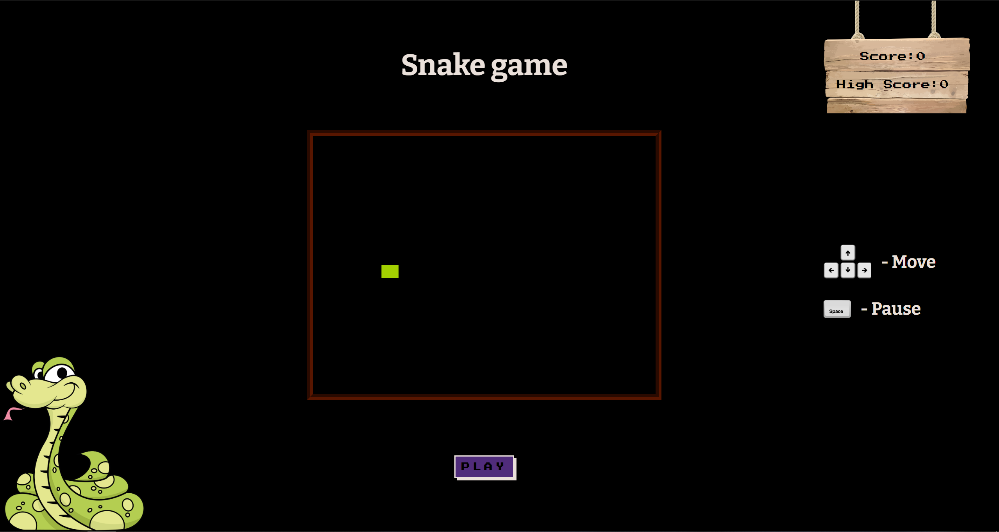
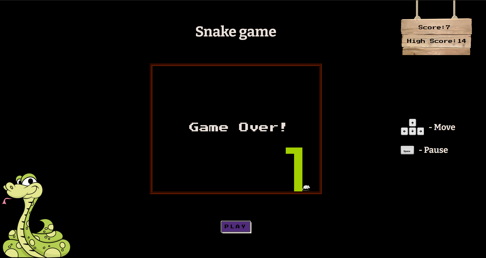

# Snake Game

Snake is an old fashion game where the player maneuvers the end of a growing line, often themed as a snake. The player must keep the snake from colliding with both other obstacles and itself, which gets harder as the snake lengthens. Additional difficulty to the game is the increasing speed of the snake every 5 points. The cap of the snake's maximum speed is 80ms and can be reached at 60 points collected. The player wins the game upon reaching 324 points.

## Technologies used

The Snake React web app was built using the following technologies:

- React: web app build
- JavaScript: web app's logic
- CSS: plain CSS for styling
- Local Storage: store user's highest score

## Deployment

[Snake React Game](https://stanimir-p.github.io/Snake-React/)